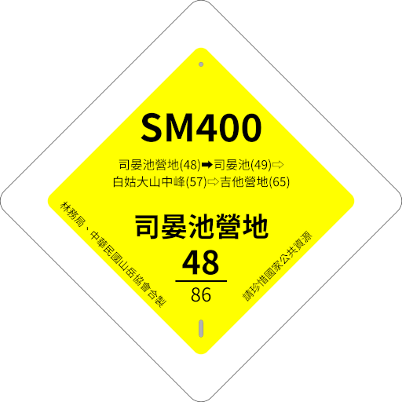
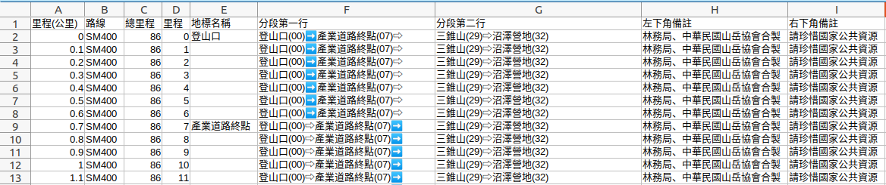
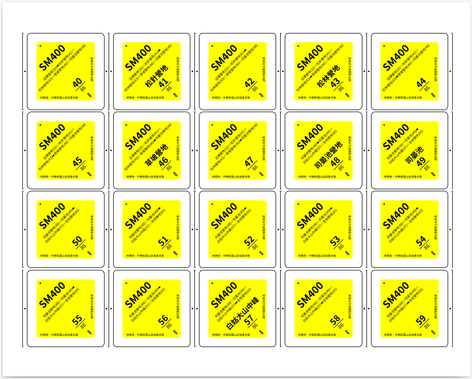

# 路標產生器



透過 CSV 資料檔及 SVG 樣版檔，大量產生出台灣目前推行的[系統化反光路標](http://taiwanmt.nchu.edu.tw/download/C2-2%E5%BC%B5%E5%9C%8B%E9%9B%84.pdf)，最後合併為 PDF 檔案。產生出之檔案可委由[科邁銘板](https://www.comaxglobal.com/zh/)進行生產，生產製具使用權請洽[桃園市山岳協會](https://www.tytaaa.org.tw/)。

## 源起

本專案源於[中華民國山岳協會](http://www.mountaineering.org.tw/)於2021年底施作[白姑大山路標](https://dongshih.forest.gov.tw/all-news/0068637)，為提升效率並有利於未來推廣，因此啟動此專案。

## 系統需求

- 作業系統: Ubuntu 20.04 LTS
- 命令列工具:
  - ruby
  - inkscape
  - pdfunite
  - gs

## Cross-platform note

This project should work cross-platform (macOS / Linux / Windows).

- If `make` / `Makefile` isn’t available on your platform (common on Windows), use the **Docker CLI** commands below or the **GUI runner** (`run_tsg_docker.py`).

## 使用方式 (以白姑大山路標為例)

一條步道底下可能有多條路線，因此設定檔以**路線代碼**為前綴命名。白姑大山只有主線一條，代碼為 `SM400`。每條路線各有 **編碼路標** 及 **空白路標** 兩部份，其設定檔位置如下：

- 編碼路標: `白姑大山/SM400_milestone.yaml`
- 空白路標: `白姑大山/SM400_blank.yaml`

命名慣例為 `<路線代碼>_milestone.yaml` 及 `<路線代碼>_blank.yaml`，資料檔則為 `<路線代碼>.csv`（空白路標共用 `blank.csv`）。路線代碼只是檔名前綴：有配發正式路標編碼的路線就用該編碼（如 `SM400`），沒有的則取一個好認的代稱（如阿玉山主線用 `mt_ayu`）。

另外請在步道目錄下放一個內容為 `/output` 的 `.gitignore`。根目錄的 `.gitignore` 並未涵蓋各步道的產出，而每次執行都會產生一份帶時間戳的 PDF 與 zip，沒有這個檔案的話產出物會不斷累積進版控。

其中**編碼路標為必需，空白路標為選配**——並非每條路線都會製作空白路標。若 `<路線代碼>_blank.yaml` 不存在，`make generate` 只會產生編碼路標並印出一行提示。

在命令列下執行以下指令即可產生路標SVG檔案：

```shell
ruby generate.rb <設定檔路徑>
```

產出之檔案會存放在 `output/` 資料夾之下，中繼檔案會暫存於 `output/intermediate/` 內。產出之檔案主要有三個部份：

- `xxxx_RGB.pdf`: RGB 色彩空間的 PDF
- `xxxx_CMYK.pdf`: CMYK 色彩空間的 PDF
- `xxxx.zip`: 中繼檔案，包括單頁的 PDF 及個別的 SVG

## YAML 設定檔說明

```
input:
  template: 樣版檔 SVG
  data: 資料檔 CSV
  mask: 遮罩檔 SVG (標示要切割反光材質的區域)
output:
  dir: 輸出資料夾
  prefix: 輸出檔名前綴字
  w: PDF頁寬(mm)
  h: PDF頁高(mm)
  slot:
    x: 路標印製起始點X座標(mm)
    y: 路標印製起始點Y座標(mm)
    w: 路標寬度(mm)
    h: 路標高度(mm)
    repeat:
      x: X軸路標數量
      y: Y軸路標數量
```

### CSV 資料檔



資料檔的第一列為資料名稱，程式會從第二列開始在 SVG 樣版檔中尋找資料名稱，並取代為資料內容，最後產生出 SVG 檔。

### SVG 樣版檔

樣版檔可使用 Inkscape 編輯並修改，請留意文字大小及文字框位置，以免文字超出範圍。輸出前請隱藏外框及釘孔，以免製具誤差造成的問題。白姑大山路標樣版檔中，外框及釘孔均在其專用圖層中，可直接控制圖層來隱藏或顯示。

| 輸出用(隱藏外框及釘孔) | 預覽用(顯示外框及釘孔)  |
| ---  | --- |
|  |  |

### PDF 輸出檔

程式最後會產生出多頁如以下內容的 PDF 檔，送印前請務必再次人工確認：




## docker 使用方式

To build the docker image, run the following command:

```shell
$ docker build -t rudychung/tsg docker
[+] Building 124.1s (22/22) FINISHED
 => => naming to docker.io/rudychung/tsg:latest         0.0s
 => => unpacking to docker.io/rudychung/tsg:latest      4.5s
```

Or use the Makefile shortcut:

```shell
$ make docker/build
```

To run the docker image with a GUI, run the following command:

```shell
$ ./run_tsg_docker.py
$
```

To run the docker image, run the following command:

```shell
$ docker run -it --rm --user builder -v $PWD:/home/builder/workdir -e TERM=$TERM rudychung/tsg 白姑大山/SM400_milestone.yaml
## ...
$
```

Or use the Makefile shortcut:

```shell
$ make docker/generate 白姑大山 SM400
```

## Makefile shortcuts

This repo’s `Makefile` takes the trail directory and one or more line codes as positional arguments:

```
make <target> <trailDir> <LINE_CODE...>
```

Run `make` with no arguments to print the available targets.

- Generate both milestone + blank PDFs locally (Ruby):

```shell
$ make generate 白姑大山 SM400
```

- Generate several lines of the same trail in one go, by listing their codes. Each line's milestone and blank specs are run in turn, and the batch stops at the first failure:

```shell
$ make generate <trailDir> <CODE_A> <CODE_B>
```

- Clean outputs for a trail:

```shell
$ make clean 白姑大山
```

Safety note: `TRAIL` is validated to ensure it resolves under the repo root (`$(CURDIR)`), to avoid accidental deletion outside the workspace.

To run the docker image with a shell, run the following command:

```shell
docker run -it --rm --user builder -v $PWD:/home/builder/workdir -e TERM=$TERM --entrypoint /bin/bash rudychung/tsg --login
builder@3b3c534456eb:~/workdir$ ruby generate.rb 白姑大山/SM400_milestone.yaml
Reading spec: 
rm -rf 白姑大山/output/intermediate/
Reading data CSV: 白姑大山/SM400.csv
Replacing with headers: ["里程(公里)", "路線", "總里程", "里程", "地標名稱", "分段第一行", "分段第二行", "左下角備註", "右下角備註"]
Creating intermediate SVG: 白姑大山/output/intermediate/sign_0001.svg
...
Processing pages 1 through 10.
Page 1
Page 2
```


## 已知限制

- SVG 原生僅支援 RGB，即使將最後將 PDF 轉為 CMYK 也無法產生如 Y100 或 K100 等顏色。但以路標的需求來說，並不會有太大的問題。
