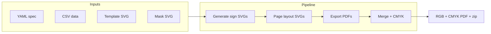

# Trail Sign Generator — Steering Document

This document is the single source of truth for the project’s purpose, architecture, tech stack, and how to run or extend it. For user-facing usage (system requirements, CSV/SVG format, Docker build), see [README.md](README.md).

---

## 1. Purpose and scope

**What:** Batch generator for Taiwan’s [systematized reflective trail signs](http://taiwanmt.nchu.edu.tw/download/C2-2%E5%BC%B5%E5%9C%8B%E9%9B%84.pdf). Takes CSV data and SVG templates, produces per-sign SVGs, lays them in a grid, and outputs merged PDFs (RGB and CMYK).

**Who:** Maintainers and contributors (e.g. 中華民國山岳協會, trail admins). Output is sent to vendors (e.g. 科邁銘板) for production; production tooling rights are via 桃園市山岳協會.

**Scope:** This repo owns the generator only: spec format, pipeline, and Docker. It does not own print specs, vendor contracts, or trail content authoring workflows.

---

## 2. Architecture and data flow

**Inputs (per run):**

- One YAML spec (e.g. `白姑大山/SM400_milestone.yaml`) defining paths and layout
- CSV whose headers are placeholder names in the template
- Template SVG and mask SVG (paths in YAML)

**Pipeline:**

1. Read YAML; resolve all paths relative to the directory containing the spec file.
2. For each CSV data row: fill template SVG with header→value substitution; write `sign_NNNN.svg`; run Inkscape to vectorize (plain SVG, text-to-path).
3. Build page SVGs by placing sign SVGs in a grid (slot x/y, repeat x/y from YAML).
4. Export each page SVG to PDF via Inkscape.
5. Build full-page mask SVG and export to `mask.pdf`.
6. Merge page PDFs + mask PDF → one RGB PDF; then Ghostscript → CMYK PDF.
7. Zip intermediate SVGs (optional artifact).

**Outputs:** `{prefix}{timestamp}_RGB.pdf`, `{prefix}{timestamp}_CMYK.pdf`, `{prefix}{timestamp}.zip` under the spec’s `output.dir`.

---

## 3. Tech stack and dependencies

| Layer | Technology |
|-------|------------|
| **Runtimes** | Ruby (primary generator), Python 3 (alternative generator + GUI) |
| **External tools** | Inkscape, Ghostscript (`gs`), pdfunite (poppler-utils) — must be on PATH or in Docker |
| **Python GUI** | [run_tsg_docker.py](run_tsg_docker.py) uses Gooey to run the Docker image with a chosen working directory and YAML file |
| **Container** | Docker image (e.g. `rudychung/tsg`) based on Ubuntu; includes Ruby, Inkscape, Ghostscript, poppler-utils; entrypoint is `ruby generate.rb`. No Python in image — GUI runs on host and invokes Docker |

See [docker/Dockerfile](docker/Dockerfile) and [README.md](README.md) for exact versions and install instructions.

---

## 4. Key files and roles

| Role | File(s) |
|------|--------|
| Spec and data | `白姑大山/*.yaml`, `*.csv`, `*.svg` (template + mask) — one directory per trail/campaign |
| Canonical generator | [generate.rb](generate.rb) — used by Docker and Makefile; reference implementation |
| Alternative generator | [generate.py](generate.py) — same behavior for environments without Ruby; port of generate.rb |
| Docker launcher (GUI) | [run_tsg_docker.py](run_tsg_docker.py) — selects PWD and YAML, runs `docker run ... rudychung/tsg <yaml>` |
| Batch run | [Makefile](Makefile) — runs the milestone and blank YAMLs for the given trail and line codes |

---

## 5. YAML spec contract

Both generators expect the following schema. All paths are relative to the directory containing the YAML file.

| Key | Description |
|-----|-------------|
| `input.template` | Path to template SVG |
| `input.data` | Path to data CSV |
| `input.mask` | Path to mask SVG |
| `output.dir` | Output directory (relative to spec dir) |
| `output.prefix` | Prefix for output filenames |
| `output.w`, `output.h` | Page size in mm |
| `output.slot.x`, `output.slot.y` | Origin of first sign on page (mm) |
| `output.slot.w`, `output.slot.h` | Size of one sign (mm) |
| `output.slot.repeat.x`, `output.slot.repeat.y` | Grid: number of signs per page in x and y |
| `output.slot.repeat.num` | Optional: max number of signs to generate |
| `output.slot.gsub` | Optional: key→value string replacements applied to slot SVGs |

Specs are named `<LINE_CODE>_milestone.yaml` and `<LINE_CODE>_blank.yaml`, so one trail directory can hold several lines side by side. The milestone spec is required; the blank one is optional, as not every line orders blank signs. Examples: [白姑大山/SM400_milestone.yaml](白姑大山/SM400_milestone.yaml), [白姑大山/SM400_blank.yaml](白姑大山/SM400_blank.yaml). Full usage notes are in [README.md](README.md).

---

## 6. How to run

| Method | Command |
|--------|---------|
| **Local (Ruby)** | `ruby generate.rb <path/to/spec.yaml>` from repo root. Requires Ruby, Inkscape, pdfunite, gs. |
| **Local (Python)** | `python3 generate.py <path/to/spec.yaml>`. Same external tools. |
| **Docker (CLI)** | `docker run -it --rm --user builder -v $PWD:/home/builder/workdir -e TERM=$TERM rudychung/tsg <spec.yaml>` — spec path is relative to mounted dir. |
| **Docker (GUI)** | `./run_tsg_docker.py` or `python3 run_tsg_docker.py`; choose directory and YAML in the GUI. |

The [Makefile](Makefile) takes the trail directory and one or more line codes positionally, and runs the milestone + blank specs of each line as a single batch — e.g. `make generate 白姑大山 SM400`, or `make generate <trailDir> <CODE_A> <CODE_B>` for several lines at once. A bare `make` prints the available targets.
For maintainers, `make generate <trailDir> <LINE_CODE...>`, `make docker/generate <trailDir> <LINE_CODE...>` and `make clean <trailDir>` are available; the trail directory is validated to stay under the repo root.

---

## 7. Adding a new trail or variant

1. Add a new directory (e.g. `新路線/`).
2. Copy and adapt a spec YAML, CSV, template SVG, and mask SVG from 白姑大山 or another trail.
3. Run the generator with the new spec path; outputs go to that trail’s `output/` (or whatever `output.dir` is set to).

No code changes are required if the spec and assets conform to the YAML contract above.

---

## 8. Conventions and decisions

- **Paths:** All paths in the YAML are relative to the directory containing the YAML file.
- **Reference implementation:** Ruby ([generate.rb](generate.rb)) is the source of truth; [generate.py](generate.py) is a port and should match its behavior.
- **Output layout:** Intermediate files under `output/intermediate/`; final PDFs and zip in `output/` with prefix + timestamp to avoid overwriting.
- **Docker:** Container runs as non-root user `builder`; workdir is `/home/builder/workdir` and the repo is mounted there.
- **Cross-platform:** The project should remain usable on macOS / Linux / Windows. The `Makefile` is a convenience for environments with GNU Make; Windows users can run via Docker CLI or `run_tsg_docker.py`.

---

## 9. Known limitations

- **Color:** SVG is RGB-only; CMYK PDF is produced by Ghostscript conversion. Pure spot colors (e.g. Y100, K100) are not guaranteed; acceptable for current trail-sign use (see [README.md](README.md) 已知限制).
- **Fonts:** Template design and fonts are the user’s responsibility; Inkscape “text to path” avoids font dependency in the final PDF.
